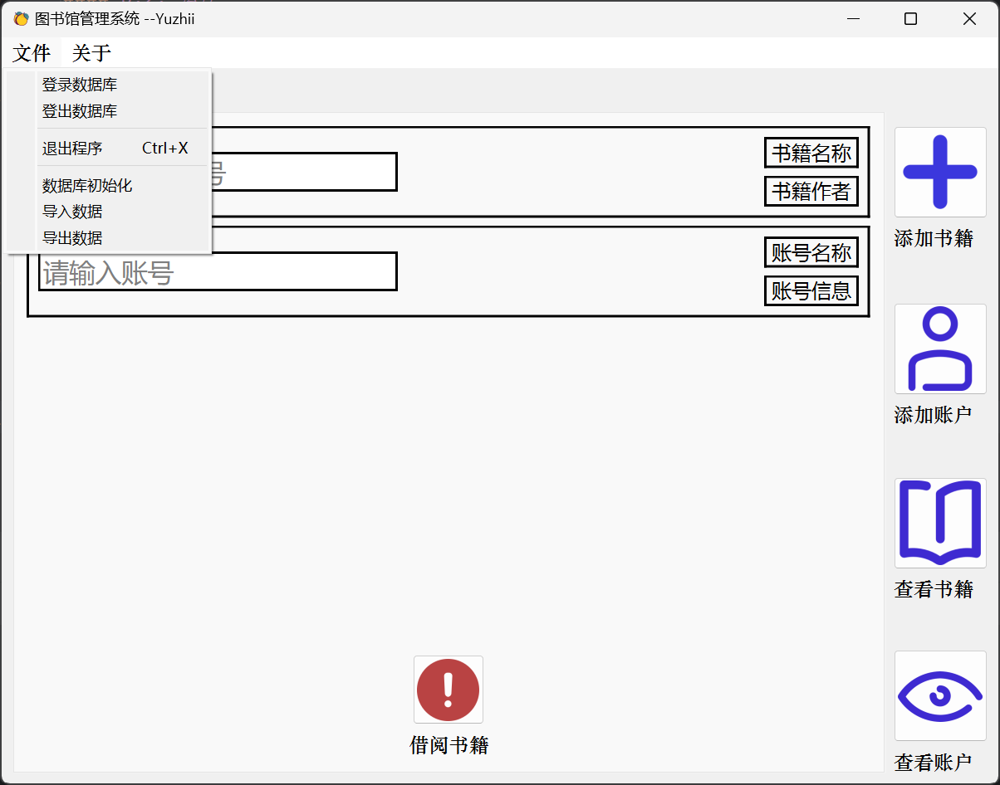
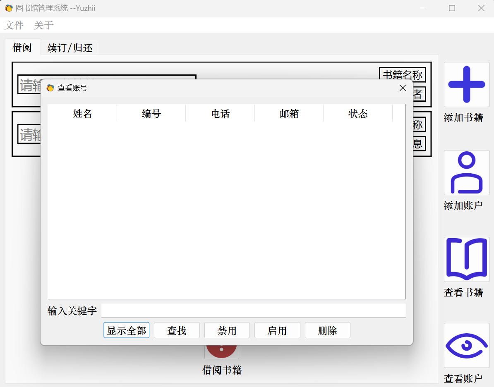

Language: English | [中文](README.md)

## Library Information Management System

**note: Chinese version only**

### 1. Introduction

Library Information Management System is a library information management system based on PyQt6. The main functions include: book information management, reader information management, borrowing information management, system management, etc.

### 2. Project Structure

```
├─dist
├─module
├─src
│  ├─doc
│  │  └─images
│  ├─images
│  └─ui
└─temp
```

### 3. Usage

#### 3.1. Install dependencies

```shell
pip install -r requirements.txt
```

#### 3.2. Run

```shell
python main.py
```

#### 3.3. Package

```shell
pyinstaller -F -w main.py
```

### 4. Screenshots

 




